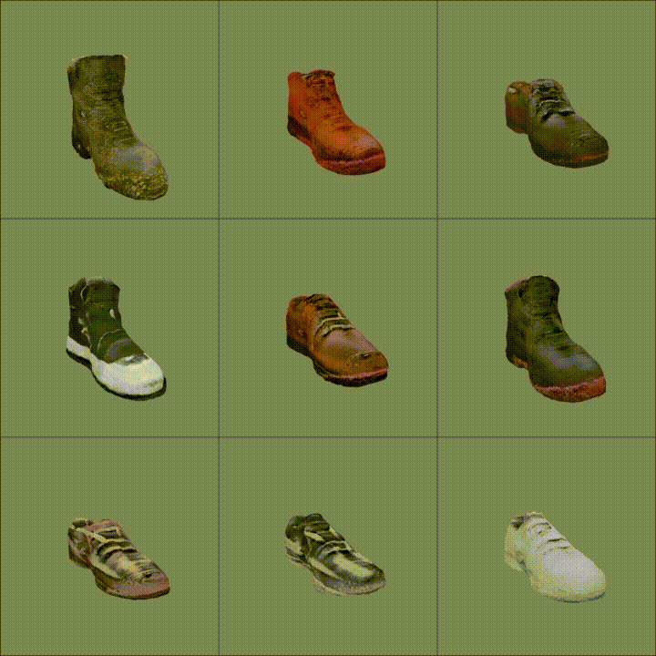

# Text-guided 3D synthesis by GET3D + NADA

|                                                     |                                             |
|-----------------------------------------------------|---------------------------------------------|
| <b>Car &rarr; Police</b>                            | <b>Car &rarr; Sketch</b>                    |
|         |    |
| <b>Motorbike &rarr; Tiger</b>                       | <b>Shoe &rarr; Mossy</b>                    |
|  |  |

> You can make any other interesting stylish 3D object!

<br>

---

## Requirement setup

* First, set GET3D environment (venv or docker image).
* Then, install extra requirements by `pip install -r extra_requirements.txt`

<br>

---

## Download checkpoints

For GET3D + NADA, you need pretrained model's checkpoint. You can set downloaded ckpt path at yaml file.

- Car, Chair, Table, Motorbike &rarr; [link](https://github.com/nv-tlabs/GET3D/tree/master/pretrained_model)

- Fruits, Shoe &rarr; [link](https://huggingface.co/datasets/allenai/objaverse/discussions/1#63c0441bd9e14fd8875cec97)

<br>

---

## Train

### Train code

If you want to train the code, please refer to the training script below.

```
$ python train_nada.py --config_path='experiments/{}.yaml' --name='{}' --suppress

optional arguments
	--config_path             select yaml file to run (in experiments folder)
	--name                    choose any name you want for log file name (optional)
	--suppress                store only latest & best pkl file

EX)
$ python train_nada.py --config_path='experiments/car_police_example.yaml' --name='car_police' --suppress
```

<br>

### Trainable Parameters

When you open yaml file, you could see many trainable parameters and configs.

Among them, below are some important parameters you could change as you conduct an experiment.

We provide some yaml files as [examples](./experiments).

<br>

**Global Config**

|          | Default Setting | Detailed explanation                                                                                                                                                                      |
|----------|-----------------|-------------------------------------------------------------------------------------------------------------------------------------------------------------------------------------------|
| batch    | 3               | Setting the batch number less than 3 resulted unfavorable results in most of the experiments. However, you could change this value to some other value that fits well to your experiments |
| iter_1st | 1               | For most of the cases, 1 was enough to generate 3d object you want. You could increase this value to see more changes in the generated objects                                            |
| iter_2nd | 30              | For most of the cases, since model converges after iter_1st, 1 was enough to generate 3d object you want. You could increase this value to see more changes in the generated objects      |

<br>

**GET3D config**

|         | Default Setting | Detailed explanation                                                                       |
|---------|-----------------|--------------------------------------------------------------------------------------------|
| n_views | 12              | You can change this value that fits your GPU memory. According to Paper, set n_views >= 16 |

<br>

**NADA config**

|                         |  Default Setting  |  Detailed explanation                                                                                                                                                                                                                                                                   |
|-------------------------|-------------------|-----------------------------------------------------------------------------------------------------------------------------------------------------------------------------------------------------------------------------------------------------------------------------------------|
| lr                      | 0.002             | For most of the experiments lr 0.002 was suitable. However, you can change this value that fits your task.                                                                                                                                                                              |
| auto_layer_k            | 20 , 30           | auto_layer_k means the number of trainable layers during adaptation of GET3D. We empirically found some following tips. For texture changes + slight shape changes, setting the auto_layer_k to 20 was suitable. For only texture changes, setting the auto_layer_k to 30 was suitable. |
| source text             | pretrained object | For most of the experiments, we simply set source text to pretrained object. However, we found out that giving some text prompt to this variable showed some improvements in some cases. EX) 3D object car                                                                              |
| target text             | target object     | For most of the experiments, we simply set target text to target object. However, we found out that giving some text prompt to this variable showed some improvements in some cases. EX) 3D render in the style of Pixar                                                                |
| gradient_clip_threshold | -1                | For most of the experiments, not using gradient_clip(set as -1) was suitable. However, if the task requires some major changes in shape, using gradient clip was helpful.                                                                                                               |

<br>

---

## Inference

* You can run inference with nada checkpoint, by same code(../train_3d.py).

---

## Appendix

### CLIP util
* We provide `clip_save.py` to avoid 'connection reset by peer' error from CLIP library, which accidentally stops the runtime.

1. Do `python clip_save.py`, and then you can get `clip-cnn.pt` / `clip-vit-b-16.pt` / `clip-vit-b-32.pt`
2. Change `clip.load()` argument as follows (Note that this is used at `clip_loss.py`)
   - `clip.load('RN50')` &rarr; `clip.load('/PATH/TO/clip-cnn.pt')`
   - `clip.load('ViT-B/16')` &rarr; `clip.load('/PATH/TO/clip-vit-b-16.pt')`
   - `clip.load('ViT-B/32')` &rarr; `clip.load('/PATH/TO/clip-vit-b-32.pt')`
