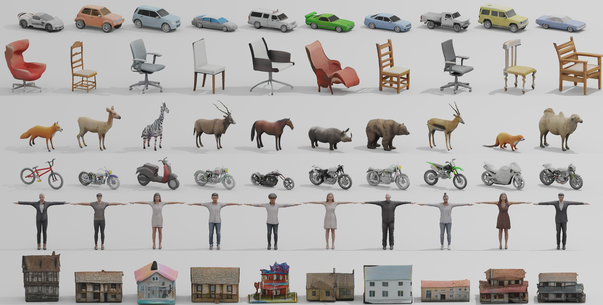

## GET3D: A Generative Model of High Quality 3D Textured Shapes Learned from Images (NeurIPS 2022)<br><sub>Official PyTorch implementation </sub>


**GET3D: A Generative Model of High Quality 3D Textured Shapes Learned from Images**<br>
[Jun Gao](http://www.cs.toronto.edu/~jungao/)
, [Tianchang Shen](http://www.cs.toronto.edu/~shenti11/)
, [Zian Wang](http://www.cs.toronto.edu/~zianwang/),
[Wenzheng Chen](http://www.cs.toronto.edu/~wenzheng/), [Kangxue Yin](https://kangxue.org/)
, [Daiqing Li](https://scholar.google.ca/citations?user=8q2ISMIAAAAJ&hl=en),
[Or Litany](https://orlitany.github.io/), [Zan Gojcic](https://zgojcic.github.io/),
[Sanja Fidler](https://www.cs.toronto.edu/~fidler/) <br>
**[Paper](https://nv-tlabs.github.io/GET3D/assets/paper.pdf)
, [Project Page](https://nv-tlabs.github.io/GET3D/)**

Abstract: *As several industries are moving towards modeling massive 3D virtual worlds,
the need for content creation tools that can scale in terms of the quantity, quality, and
diversity of 3D content is becoming evident. In our work, we aim to train performant 3D
generative models that synthesize textured meshes which can be directly consumed by 3D
rendering engines, thus immediately usable in downstream applications. Prior works on 3D
generative modeling either lack geometric details, are limited in the mesh topology they
can produce, typically do not support textures, or utilize neural renderers in the
synthesis process, which makes their use in common 3D software non-trivial. In this work,
we introduce GET3D, a Generative model that directly generates Explicit Textured 3D meshes
with complex topology, rich geometric details, and high fidelity textures. We bridge
recent success in the differentiable surface modeling, differentiable rendering as well as
2D Generative Adversarial Networks to train our model from 2D image collections. GET3D is
able to generate high-quality 3D textured meshes, ranging from cars, chairs, animals,
motorbikes and human characters to buildings, achieving significant improvements over
previous methods.*



For business inquiries, please visit our website and submit the
form: [NVIDIA Research Licensing](https://www.nvidia.com/en-us/research/inquiries/)

## News

- 2022-10-13: Pretrained model on Shapenet released! Check more details [here](./pretrained_model)
- 2022-09-29: Code released!
- 2022-09-22: Code will be uploaded next week!

## Requirements

* We recommend Linux for performance and compatibility reasons.
* 1 &ndash; 8 high-end NVIDIA GPUs. We have done all testing and development using V100 or A100
  GPUs.
* 64-bit Python 3.8 and PyTorch 1.9.0. See https://pytorch.org for PyTorch install
  instructions.
* CUDA toolkit 11.1 or later.  (Why is a separate CUDA toolkit installation required? We
  use the custom CUDA extensions from the StyleGAN3 repo. Please
  see [Troubleshooting](https://github.com/NVlabs/stylegan3/blob/main/docs/troubleshooting.md#why-is-cuda-toolkit-installation-necessary))
  .
* We also recommend to install Nvdiffrast following instructions
  from [official repo](https://github.com/NVlabs/nvdiffrast), and
  install [Kaolin](https://github.com/NVIDIAGameWorks/kaolin).
* We provide a [script](./install_get3d.sh) to install packages.

### Server usage through Docker

- Build Docker image

```bash
cd docker
chmod +x make_image.sh
./make_image.sh get3d:v1
```

- Start an interactive docker
  container: `docker run --gpus device=all -it --rm -v YOUR_LOCAL_FOLDER:MOUNT_FOLDER -it get3d:v1 bash`

## Preparing datasets

GET3D is trained on synthetic dataset. We provide rendering scripts for Shapenet. Please
refer to [readme](./render_shapenet_data/README.md) to download shapenet dataset and
render it.

## Train the model

#### Clone the gitlab code and necessary files:

```bash
cd YOUR_CODE_PATH
git clone git@github.com:nv-tlabs/GET3D.git
cd GET3D; mkdir cache; cd cache
wget https://api.ngc.nvidia.com/v2/models/nvidia/research/stylegan3/versions/1/files/metrics/inception-2015-12-05.pkl
```

#### Train the model

```bash
cd YOUR_CODE_PATH 
export PYTHONPATH=$PWD:$PYTHONPATH
export CUDA_VISIBLE_DEVICES=0,1,2,3,4,5,6,7
```

- Train on the unified generator on cars, motorbikes or chair (Improved generator in
  Appendix):

```bash
python train_3d.py --outdir=PATH_TO_LOG --data=PATH_TO_RENDER_IMG --camera_path PATH_TO_RENDER_CAMERA --gpus=8 --batch=32 --gamma=40 --data_camera_mode shapenet_car  --dmtet_scale 1.0  --use_shapenet_split 1  --one_3d_generator 1  --fp32 0
python train_3d.py --outdir=PATH_TO_LOG --data=PATH_TO_RENDER_IMG --camera_path PATH_TO_RENDER_CAMERA --gpus=8 --batch=32 --gamma=80 --data_camera_mode shapenet_motorbike  --dmtet_scale 1.0  --use_shapenet_split 1  --one_3d_generator 1  --fp32 0
python train_3d.py --outdir=PATH_TO_LOG --data=PATH_TO_RENDER_IMG --camera_path PATH_TO_RENDER_CAMERA --gpus=8 --batch=32 --gamma=400 --data_camera_mode shapenet_chair  --dmtet_scale 0.8  --use_shapenet_split 1  --one_3d_generator 1  --fp32 0
```

- If want to train on separate generators (main Figure in the paper):

```bash
python train_3d.py --outdir=PATH_TO_LOG --data=PATH_TO_RENDER_IMG --camera_path PATH_TO_RENDER_CAMERA --gpus=8 --batch=32 --gamma=40 --data_camera_mode shapenet_car  --dmtet_scale 1.0  --use_shapenet_split 1  --one_3d_generator 0
python train_3d.py --outdir=PATH_TO_LOG --data=PATH_TO_RENDER_IMG --camera_path PATH_TO_RENDER_CAMERA --gpus=8 --batch=32 --gamma=80 --data_camera_mode shapenet_motorbike  --dmtet_scale 1.0  --use_shapenet_split 1  --one_3d_generator 0
python train_3d.py --outdir=PATH_TO_LOG --data=PATH_TO_RENDER_IMG --camera_path PATH_TO_RENDER_CAMERA --gpus=8 --batch=32 --gamma=3200 --data_camera_mode shapenet_chair  --dmtet_scale 0.8  --use_shapenet_split 1  --one_3d_generator 0
```

If want to debug the model first, reduce the number of gpus to 1 and batch size to 4 via:

```bash
--gpus=1 --batch=4
```

## Inference

### Inference on a pretrained model for visualization

- Download pretrained model from [here](https://drive.google.com/drive/folders/1oJ-FmyVYjIwBZKDAQ4N1EEcE9dJjumdW?usp=sharing).
- Inference could operate on a single GPU with 16 GB memory.

```bash
python train_3d.py --outdir=save_inference_results/shapenet_car  --gpus=1 --batch=4 --gamma=40 --data_camera_mode shapenet_car  --dmtet_scale 1.0  --use_shapenet_split 1  --one_3d_generator 1  --fp32 0 --inference_vis 1 --resume_pretrain MODEL_PATH
python train_3d.py --outdir=save_inference_results/shapenet_chair  --gpus=1 --batch=4 --gamma=40 --data_camera_mode shapenet_chair  --dmtet_scale 0.8  --use_shapenet_split 1  --one_3d_generator 1  --fp32 0 --inference_vis 1 --resume_pretrain MODEL_PATH
python train_3d.py --outdir=save_inference_results/shapenet_motorbike  --gpus=1 --batch=4 --gamma=40 --data_camera_mode shapenet_motorbike  --dmtet_scale 1.0  --use_shapenet_split 1  --one_3d_generator 1  --fp32 0 --inference_vis 1 --resume_pretrain MODEL_PATH
```

- To generate mesh with textures, add one option to the inference
  command: `--inference_to_generate_textured_mesh 1`

- To generate the results with latent code interpolation, add one option to the inference
  command: `--inference_save_interpolation 1`

### Evaluation metrics

##### Compute FID

- To evaluate the model with FID metric, add one option to the inference
  command: `--inference_compute_fid 1`

##### Compute COV & MMD scores for LFD & CD

- First generate 3D objects for evaluation, add one option to the inference
  command: `--inference_generate_geo 1`
- Following [README](./evaluation_scripts/README.md) to compute metrics.

## License

Copyright &copy; 2022, NVIDIA Corporation & affiliates. All rights reserved.

This work is made available under
the [Nvidia Source Code License](https://github.com/nv-tlabs/GET3D/blob/master/LICENSE.txt)
.

## Broader Information

GET3D builds upon several previous works:

- [Learning Deformable Tetrahedral Meshes for 3D Reconstruction (NeurIPS 2020)](https://nv-tlabs.github.io/DefTet/)
- [Deep Marching Tetrahedra: a Hybrid Representation for High-Resolution 3D Shape Synthesis (NeurIPS 2021)](https://nv-tlabs.github.io/DMTet/)
- [Extracting Triangular 3D Models, Materials, and Lighting From Images (CVPR 2022)](https://nvlabs.github.io/nvdiffrec/)
- [EG3D: Efficient Geometry-aware 3D Generative Adversarial Networks (CVPR 2022)](https://nvlabs.github.io/eg3d/)
- [DIB-R++: Learning to Predict Lighting and Material with a Hybrid Differentiable Renderer (NeurIPS 2021)](https://nv-tlabs.github.io/DIBRPlus/)
- [Nvdiffrast – Modular Primitives for High-Performance Differentiable Rendering (SIGRAPH Asia 2020)](https://nvlabs.github.io/nvdiffrast/)

## Citation

```latex
@inproceedings{gao2022get3d,
title={GET3D: A Generative Model of High Quality 3D Textured Shapes Learned from Images},
author={Jun Gao and Tianchang Shen and Zian Wang and Wenzheng Chen and Kangxue Yin
and Daiqing Li and Or Litany and Zan Gojcic and Sanja Fidler},
booktitle={Advances In Neural Information Processing Systems},
year={2022}
}
```